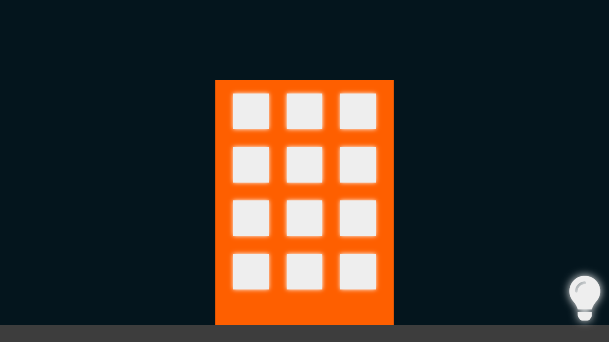

# aftersale TECH Trainee Challenge v1

Projeto desenvolvido para processo seletivo do programa trainee da aftesale.

O projeto consiste em um pequeno cenário contendo um prédio com 12 janelas. Ao clicar nas janelas as luzes ligam e desligam. Também há um botão onde todas as luzes são acesas ou apagadas.

## Tecnologias :hammer_and_wrench:

O projeto foi desenvolvido apenas com HTML, CSS e Javascript, sem o uso de qualquer lib ou framework. 

Fiz uso da Sunset Sunrise API junto com a API do browser de geolocalização para identificar se é dia ou noite no local do usuário e então alterar o o background da cena.

## Demonstração :art:

Cenário dia:

Cenário noite

Demonstração animada:

